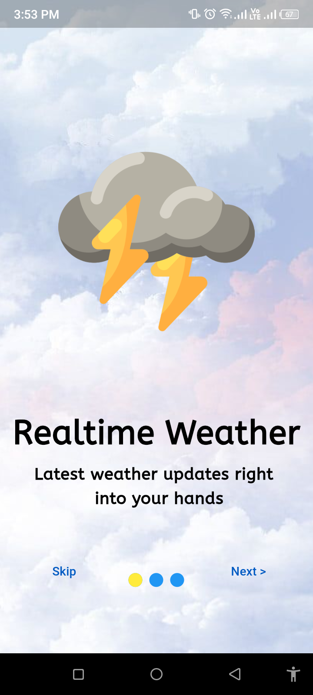
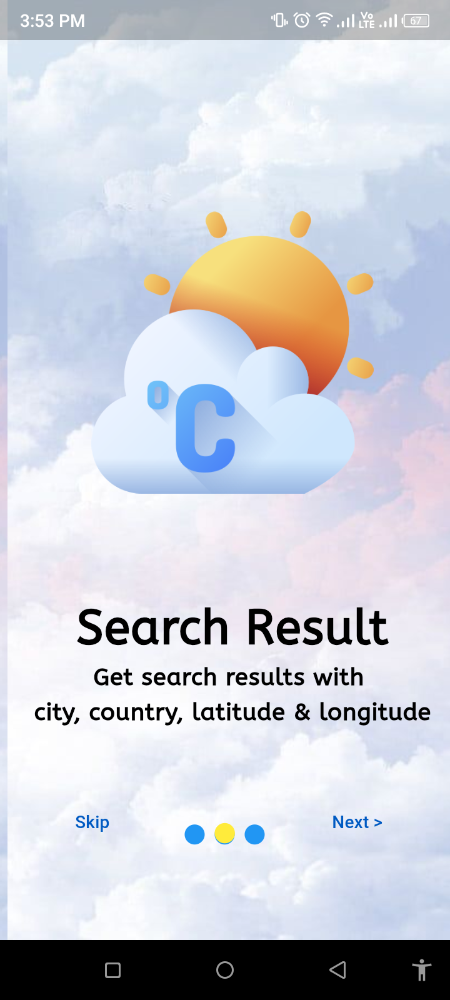
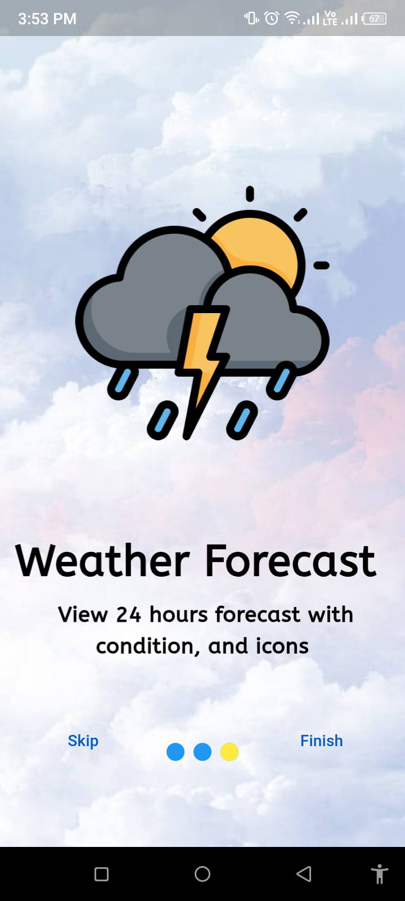
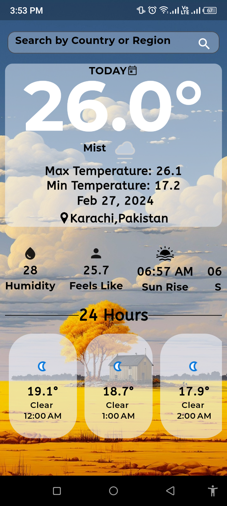
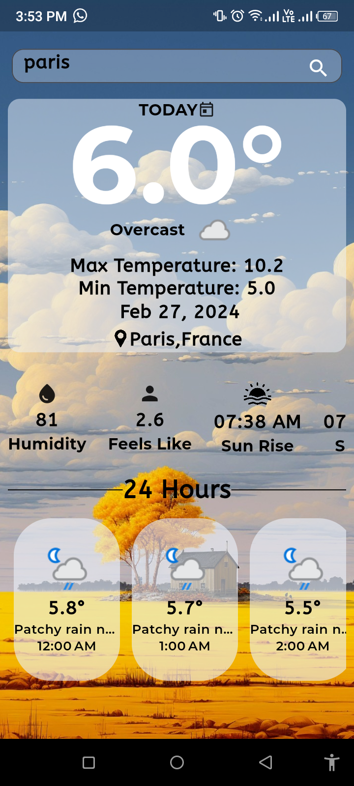

# Flutter Weather App       

## Overview
 
 Dynamic weather app built with Flutter! 🚀 Offering real-time weather updates, intuitive UI, and a seamless user experience, this app brings accurate forecasts right to your fingertips.

## Features

🌡️ Current temperature, max and min forecasts

🌤️ Hourly and daily weather updates

🌏 Global location search

📅 Date and time functionality

🌅 Sunrise and sunset information

🌬️ Wind speed and humidity details

📍 Sleek design with user-friendly interface

## Screenshots

                             

                              

                              

## How to Use

1. **Installation:**
   - Clone the repository.
   - Install dependencies using `flutter pub get`.

2. **Run the App:**
   - Use `flutter run` to launch the application on your emulator or connected device.

## Technologies Used

- Flutter
- Dart

## Contributions

We welcome contributions from the community to enhance the app's functionality, add new features, or improve the user interface. If you have ideas or improvements, please feel free to submit a pull request.

Happy Weather! ☁☀🌤🌦🌥
